# Water Futures AI - System Architecture

## System Overview


## Data Flow Architecture

```mermaid
sequenceDiagram
    participant U as User
    participant UI as React UI
    participant CB as ChatbotV2
    participant API as FastAPI
    participant FA as Farmer Agent
    participant ALP as Alpaca Client
    participant CROSS as Crossmint
    
    U->>UI: Open Chat
    UI->>CB: Initialize Chat
    
    alt Chat Mode (Safe)
        U->>CB: Ask Question
        CB->>API: POST /api/v1/chat
        API->>FA: process_request(mode="chat")
        FA->>FA: Analyze Intent
        FA-->>API: Information Response
        API-->>CB: Display Info
        CB-->>U: Show Response
    else Agent Mode (Live)
        U->>CB: Enable Agent Mode
        CB->>U: Show Warning Dialog
        U->>CB: Confirm Agent Mode
        CB->>CB: Set agentMode=true
        
        U->>CB: "Buy 5 water futures"
        CB->>API: POST /api/v1/agent/execute
        API->>FA: process_request(mode="agent")
        FA->>ALP: place_water_futures_order()
        ALP->>ALP: Map Symbol (NQH25→SPY)
        
        Note over CB,U: Trade Approval Dialog
        CB->>U: Show Trade Details
        alt User Approves
            U->>CB: ACCEPT Trade
            CB->>API: Confirm Execution
            ALP->>ALPACA: Submit Order
            ALPACA-->>ALP: Order Confirmation
            ALP-->>FA: Trade Result
            FA-->>API: Execution Details
            API-->>CB: Success Response
            CB-->>U: Trade Executed ✅
        else User Declines
            U->>CB: DECLINE Trade
            CB->>API: Cancel Trade
            API-->>CB: Trade Cancelled
            CB-->>U: Trade Cancelled ❌
        end
    end
    
    alt Subsidy Processing
        U->>CB: "Process drought subsidy"
        CB->>API: POST /api/v1/agent/execute
        API->>FA: process_request(subsidy)
        FA->>CROSS: Process Payment
        CROSS-->>FA: Payment ID
        FA-->>API: Subsidy Processed
        API-->>CB: Success Response
        CB-->>U: Subsidy Claimed 💰
    end
```



## Component Architecture

```mermaid
graph LR
    subgraph "Frontend Components"
        APP[App.tsx]
        LAY[Layout.tsx]
        CHAT[ChatbotV2.tsx<br/>Trade Approval UI]
        TRADE[Trading.tsx]
        FORE[Forecast.tsx]
        NEWS[News.tsx]
        ACC[Account.tsx]
    end
    
    subgraph "Backend Services"
        MAIN[main_simple.py]
        FA[farmer_agent.py]
        ALP[alpaca_mcp_client.py]
        MCP[mcp_connector.py]
        VAI[vertex_ai_service.py]
        DS[data_store.py]
        DB[database.py]
    end
    
    subgraph "API Routes"
        R1[/api/v1/chat]
        R2[/api/v1/agent/execute]
        R3[/api/v1/agent/action]
        R4[/api/v1/water-futures/*]
        R5[/api/v1/forecasts/*]
        R6[/api/v1/trading/*]
        R7[/api/v1/news/*]
    end
    
    APP --> LAY
    LAY --> CHAT
    LAY --> TRADE
    LAY --> FORE
    LAY --> NEWS
    LAY --> ACC
    
    CHAT -.->|Chat Mode| R1
    CHAT ==>|Agent Mode| R2
    CHAT ==>|Approved Action| R3
    TRADE --> R6
    FORE --> R5
    NEWS --> R7
    ACC --> R4
    
    R1 --> FA
    R2 --> FA
    R3 --> MCP
    R4 --> DS
    R5 --> VAI
    R6 --> ALP
    R7 --> DS
    
    FA --> ALP
    FA --> MCP
    FA --> VAI
    MCP --> ALP
    DS --> DB
    
    style CHAT fill:#ff6b6b
    style FA fill:#4ecdc4
    style R2 stroke:#ff0000,stroke-width:3px
```

## Trade Approval Flow


## Security Architecture


## MCP Server Integration


## Database Schema


## Deployment Architecture


## Performance Metrics


---

This architecture documentation provides a comprehensive view of the Water Futures AI platform, showing how all components interact, the security measures in place, and the flow of data through the system. The trade approval mechanism ensures users maintain control over all financial decisions while benefiting from AI-powered insights and automation.